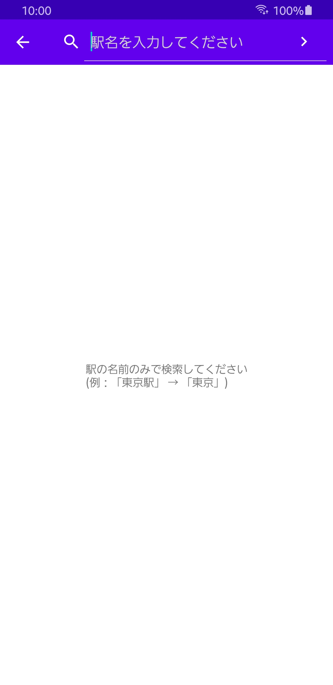

Proj4_Kotlin_Ver「乗り過ごし防止アプリ」

***

## 概要

うとうとしたりスマートフォンに夢中になるあまり、降りるべき駅を通り過ぎることを防止するためのアプリケーションです  
ユーザーが降りる駅と通知してほしいタイミング(駅から何メートル)を設定すると、HeadsUp通知でお知らせします。また、ユーザーが有線・無線イヤホンなどをしている場合に限り、イヤホンから事前に設定したアラームでお知らせします。

***
## 主な画面

  

アプリケーションを起動すると位置情報の取得の許可が求められます。こちらのアプリケーションはバックグラウンドで位置情報を取得するためOreo以降のAndroidでは「常に許可」を選択してもらう必要があるため、ダイアログにてユーザーに知らせます。なお、Oreo以前のAndroidで起動すると常に許可をする必要はないので別の説明文でユーザーに選択を促します。

　

位置情報の取得を許可するとアプリケーションの画面が見えます。ToolbarにあるMenuは左が履歴、右の三点リーダーアイコンのメニューを開くとアラーム音の設定やCreditの記載などがされているページに遷移することができます。

Toolbarの下にあるMapは目的の駅が未選択の場合は自分自身の位置をマーカーにてお知らせします。この位置情報の取得は1度のみのため起動してから移動しても更新されませんが、電池の消耗を抑えることができています。

画面中心にある2つのボタンは目的の駅を選択するためのボタンで、駅名で検索するか、都道府県・路線・駅の順でリストから選択する2種類があります。

 

上の画像は駅名で検索で選択した画面です。検索する際の注意事項を画面中央に表示して無駄な試行錯誤をしなくて良いようにしています。駅名がヒットすると路線がリストで表示され、選択するとMapが表示されている画面に戻ります。

 

こちらはリストで選択を押した場合の画面です。上の画像のようなリストで都道府県を選択し、路線を選択し、駅を選択します。駅を選択するとMapが表示されている画面に戻ります。

 

駅を選択してからMapに戻るとアラームセットボタンが活性状態になり、アラームをセットすることができます。アラームセットボタンの上にはスライダーがあり、こちらで駅から何メートル離れた位置でユーザーに通知するかを設定できます。

 

アラームをセットするとセット中の駅名などが表示され、ボタンはアラームを解除するボタンのみとなります。また、アラームのセット中は通知バーにServiceが起動していることが通知されます。こちらの通知はForegroundServiceを起動するうえで必要な通知なので消すことはできません。

駅に指定した距離接近すると上画像の様にHeads_up通知が出現し停止ボタンを押すまで設定したアラームが鳴動し続けます。このアラーム音は電車内でスピーカーから流れると周囲の人に迷惑となるため有線イヤホン・無線イヤホンを接続しているときのみ鳴動します。

アラームをセットすると履歴が残ります。こちらの履歴をタップすると同じアラーム条件をMap画面に反映できます。

***

## 使用した技術・ライブラリ

- [ジオフェンス](https://developer.android.com/training/location/geofencing?hl=ja)
  - このアプリのコアとなるものです。範囲内に入ったこと通知してくれたり位置情報の取得を勝手にしてくれるもので、便利ですが問題もありWifiや基地局から位置情報を取得できないため取得が遅い、できない等の問題があります。

- [Fuel](https://github.com/kittinunf/fuel)
  - HeartRailsAPIから路線情報、駅情報を取得する際に使用しました。またJSONのデシリアライズもできるため路線情報のリスト化はこちらで行いました。

- [Jackson](https://github.com/FasterXML/jackson-module-kotlin)
  - 駅情報のJSONは入れ子になっており情報も多かったので、より簡単にリスト化できるJacksonを用いました。

- [EventBus](https://github.com/greenrobot/EventBus)
  - ジオフェンスが指定範囲内に入ったときにBroadcastReceiverがそのイベントを受け取りますが、HeadsetPlugReceiverのようにコンテキストをキャストできなかったのでEventBusを用いてGeofenceServiceに通知しています。

- [oss-licenses-plugin](https://github.com/google/play-services-plugins/tree/master/oss-licenses-plugin)
  - 上記のライブラリ等を一括でリスト化してくれるものです。

***

## 注意

GithubにあがっているものをそのままクローンしてもAPIキーがないので動きません。